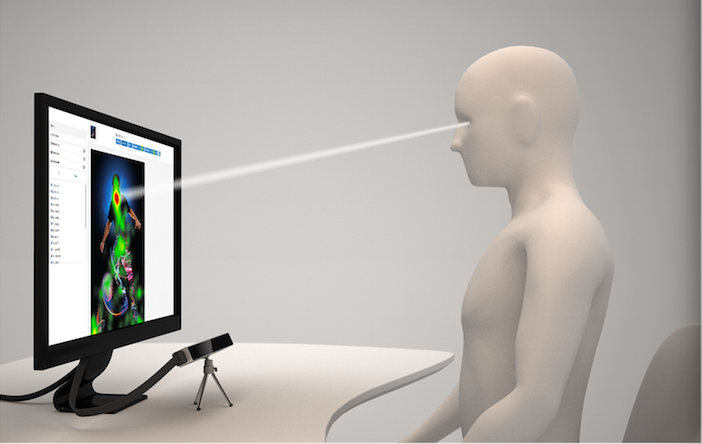
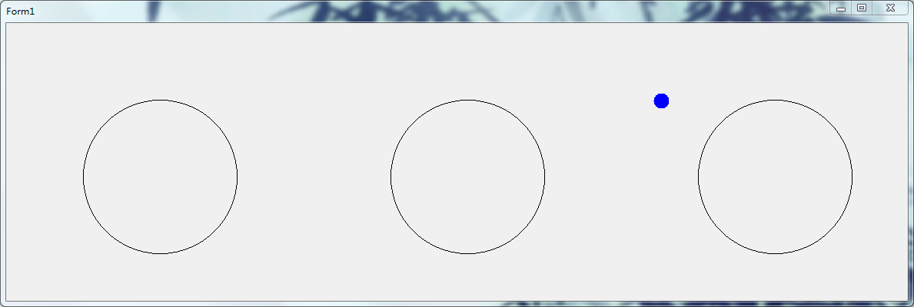
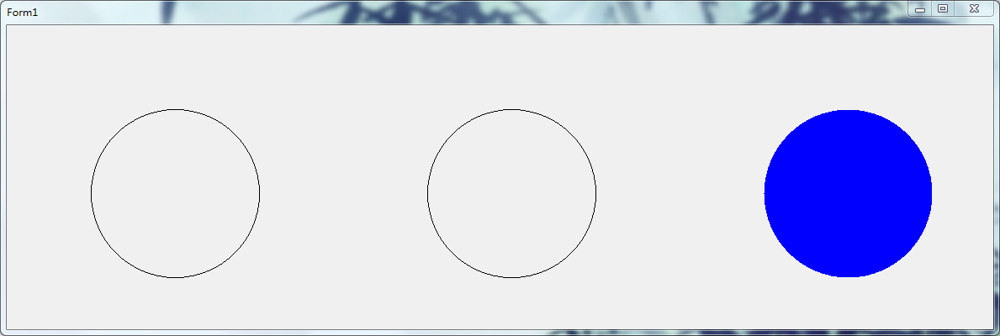
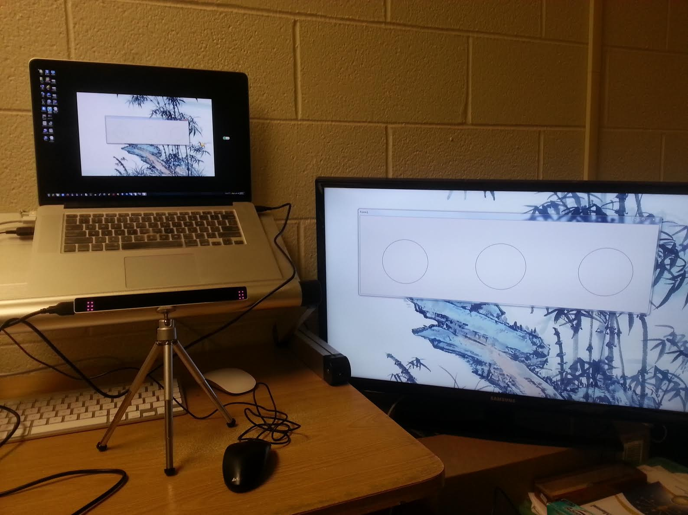

#眼球追踪检测系统 Demo版

这个项目使用 The Eye Tribe Tracker眼球追踪设备，实现在windows平台上实时检测使用者眼球在屏幕上的焦点，并支持远程和单机的数据通信。

***

###The Eye Tribe Tracker简介 
The Eye Tribe Tracker是一个计算眼球凝视点的外接设备。

连接了仪器的设备可以实时追踪用户在屏幕上的凝视点，并把它转化为与屏幕相对应的x，y轴坐标。
该技术可以应用于广泛的医疗领域，比如对病人注意力的检测及眼科疾病的检查。

它配备了USB 3.0接口，可以直接插到PC或者平板上（目前只支持Windows），这样PC/平板就可以实时进行视线的接收和追踪，提供C#，C++及JAVA的SDK供开发者使用。价格也只需要99美元。

###使用说明 

##### 安装与配置
1）在官网下载并安装客户端 EyeTribe UI 和 EyeTribe Server。

地址：https://theeyetribe.com/order/my-account/，需要购买时的账号和密码才能下载。

***

2）使用USB线将 The Eye Tribe Tracker 与电脑连接。

***
3）将tracker装在三角架上。并放置于屏幕前面。

***
4）打开 Eyetribe Server   这是一个后台程序，他负责接受仪器数据。
***

5）调整坐姿，使脸部在扫描范围内。

如何判断是否在扫描范围内呢？打开 EyeTribe UI，你会看到以下几种可能：

最左边为完全在扫描范围内，最右边就完全扫描不到了。

现在仪器已经准备就绪了。
***

####进行仪器校正

每次使用之前，the eye tribe tracker 都需要进行仪器校正才能正确获得使用者在屏幕上的凝视点。
之后只要使用者面部不离开扫描范围，就能持续追踪。

校正的方法：

打开 EyeTribe UI：
 并选Calibration，这时会出现以下画面：

眼镜只要盯着红点即可，星星代表的是校正准确度。仪器校正完后就可以正常使用了。

****

####监测系统的使用
监测系统可以使医生实时双屏或远程观察病人的焦点的位置。本系统在windows上运行。

在安装和配置好 The Eye Tribe Tracker 后，首先打开服务器端，会弹出一个窗口。这个窗口和病人将要看到的窗口大小和内容都一样。在窗口里会有蓝色的小圆点，这个小圆点就是病人在其窗口正在看的目标了。

本系统也实现了碰撞检测功能，当病人看着窗口中三个圆的其中一个时，系统就会检测到并填充变服务器端圆的颜色。

而在客户端即病人端的窗口，可以设置为不出现小圆点和不进行碰撞检测。所有信息只会在医生端显示。

该系统很容易接入到已有的医疗检测软件中，为程序增加眼球追踪的功能。

######本地多屏的实现：  
现在的win7系统都支持多屏显示，所以只需增加一个屏幕给医生观看即可。
例如这样：

######远程监控的实现： 
首先在医生电脑上打开程序，客户端的程序只需要获得医生电脑的ip地址，即可建立远程连接。
***
####视频演示

地址：http://v.youku.com/v_show/id_XNzQzMjcyNTM2.html?firsttime=0

密码9999
***
庄恩泽 2014.07.26

